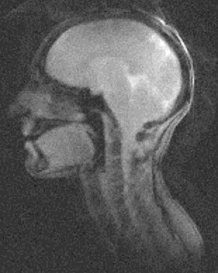
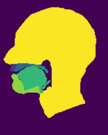

# VOCAL-TRACT-SEGMENTATION
The project aims to implement a Ruthven U-net architecture for vocal tract segmentation using Real-Time Magnetic resonance (rtMR) images. The vocal tract segmentation involves identifying six regions: Upper lip, Hard palate, Soft palate, Tongue, Lower lip, and Head. The focus is particularly on the accurate segmentation of the Soft palate and Tongue, as their motion and anatomical features play a crucial role in speech-related issues.

  
   

## PREPROCESSING
The preprocessing phase aimed to eliminate Gaussian noise in the provided dataset through three tests. Several methods have been performed; the one that demonstrates the most effective noise reduction was the **fastNlMeansDenoising**, a function already implemented in the OpenCV library.

  

## MODEL
The model architecture is based on the Ruthven U-net, consisting of encoder and decoder paths.
To enhance U-net's performance, residual blocks are introduced into the architecture. This modification involves transforming basic blocks into residual blocks by concatenating the first block's input with the second's output in the same layer. This operation is repeated in both the decoder and encoder parts. Incorporating residual blocks allows the network to capture intricate features, proving beneficial for segmentation tasks involving subtle details.

  

The evolution of learning can be assessed by examining the segmentation outcomes at various epochs throughout the training process shown in the GIF below:

  

## RESULTS
The DICE is the metric used to evaluate the performance of our model. 
As final post-processing, a median filter is used to smooth out irregularities of the images trying to remove those pixels belonging to a class different with respect to the surrounding one. In the table below, the performances before (DICE) and after median filter (DICE MF) are shown:

  
| CLASS         | DICE  | DICE MF |
|:-------------:|:-----:|:----:|
| BACKGROUND    | 0.9911| 0.9913 |
| UPPER LIP      | 0.9013| 0.8473 |
| LOWER LIP      | 0.8476| 0.8164 |
| HARD PALATE    | 0.7910| 0.8184 |
| SOFT PALATE    | 0.9320| 0.9276 |
| TONGUE         | 0.8858| 0.8783 |
| HEAD           | 0.9669| 0.9657 |
  

