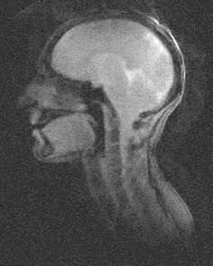
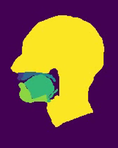
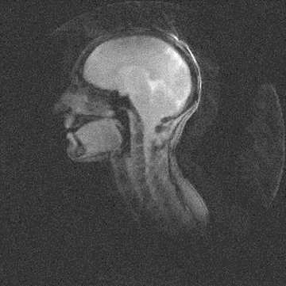

# VOCAL-TRACT-SEGMENTATION
The aim of the project is to implement a Ruthven U-net architecture for vocal tract segmentation using Real Time Magnetic Resonances (rtMR) images. The vocal tract segmentation involves identifying six regions: Upper lip, Hard palate, Soft palate, Tongue, Lower lip, and Head. The focus is particularly on the accurate segmentation of the Soft palate and Tongue, as their motion and anatomical features play a crucial role in speech-related issues.

  
   

## PREPROCESSING
The preprocessing phase aimed to eliminate Gaussian noise present in the provided dataset through three tests. Several methods have been performed; the one that demonstrates the most effective noise reduction was the **fastNlMeansDenoising**, a function already implemented in OpenCV library.

  

## MODEL
## RESULTS
- The model architecture is based on the Ruthven U-net, consisting of encoder and decoder paths. In the encoder path, high-level features are extracted by progressively reducing spatial dimensions and increasing the number of feature maps. This process results in a latent representation space where spatial resolution is sacrificed for high-level features. The decoder path aims to restore the initial image's spatial dimension, utilizing transpose convolutional layers in combination with standard blocks. Skip connections are incorporated at each step to preserve spatial information extracted by the encoder.
To enhance U-net's performance, residual blocks are introduced into the architecture. This modification involves transforming basic blocks into residual blocks by concatenating the input of the first block with the output of the second in the same layer. This operation is repeated in both the decoder and encoder parts. The incorporation of residual blocks allows the network to capture intricate features, proving beneficial for segmentation tasks involving subtle details.

  

  

  
   

